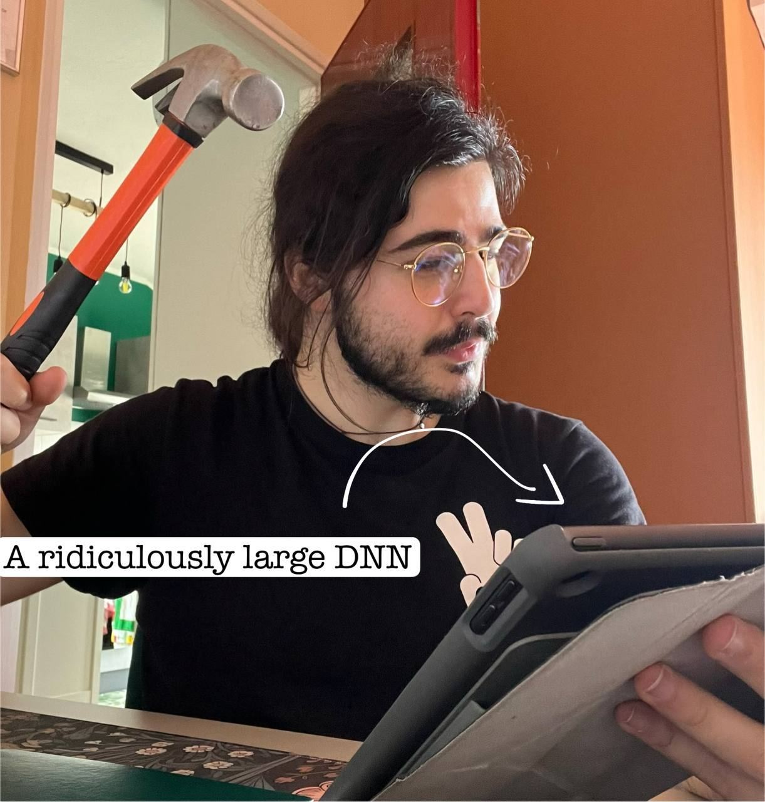

+++
insert_anchor_links = "right"
title = "Matteo Risso"
+++


```
      q-p        q-p       q-p        q-p       q-p        q-p  
     /\"/\      /   \     /\"/\      /   \     /\"/\      /   \ 
    (`=*=')    (     )   (`=*=')    (     )   (`=*=')    (     )
     ^---^`-._  `-(-'     ^---^`-._  `-(-'     ^---^`-._  `-(-' 
                   )                    )                    )
```


# About Me
<aside>

An average day during my PhD.
</aside>

*Hi! I am Matteo Risso.*

*I hold a Bachelor's degree in Physical Engineering and a Master's degree in **Electronic Engineering** from Politecnico di Torino in Italy, awarded in 2018 and 2020, respectively. 
Currently, I am immersed in my Ph.D. journey, specializing in **Computer Engineering** at the same institution.*

*My academic journey has always been fueled by a relentless curiosity and a passion for technology. I am deeply fascinated by Machine Learning and **Deep Learning**, and I thrive on the challenges of **Design Automation** and the intricacies of building **Energy-Efficient Embedded Systems**. Moreover, I'm really intereseted into **maths**, **formal methods**, and **programming language theory**. I believe that these fields hold the keys to shape a smarter and better world for everyone, where technology goes hand in hand with the good.*

*I like to define myself as a technology enthusiast, driven by a boundless curiosity and an insatiable hunger for knowledge. I always do my best to not only work hard but also work smart. I always strive to be a valuable team player, collaborating effectively to achieve shared goals.*

*On this webpage, you will find my CV, [links to my code](https://github.com/matteorisso) and [my research](https://scholar.google.com/citations?user=ltE9im8AAAAJ&hl=en). Moreover, you may find some random thoughts in the [blog section](@/blog/_index.md). I hope you enjoy your stay!*