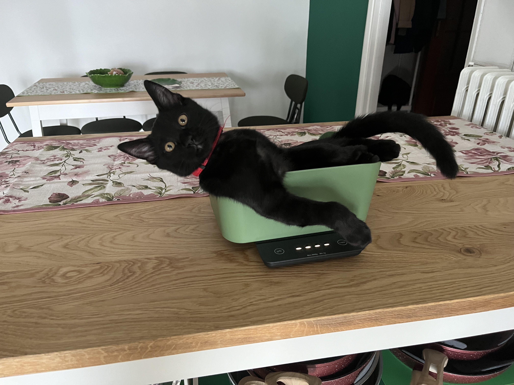
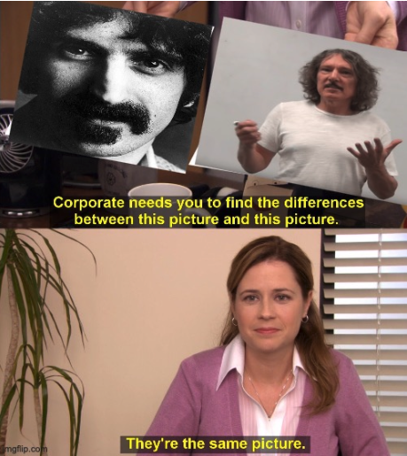

+++
authors = ["Matteo Risso"]
title = "Weekly Summary 02"
description = "Weekly Summary 02."
date = 2024-08-12
[taxonomies]
tags = ["Weekly Summary"]
[extra]
banner = "ws02.jpg#pixels"
toc = true
+++

# Disclaimer

Last time after some blabbering I put a picture of my cat, so I think that I will do the same this time.

<figure>

<figcaption>Elio Fabrizio, again.</figcaption>
</figure>

Anyway, this week I have mainly (only) readings to share.

# Readings
- We are going on with [*Gödel, Escher, Bach: an Eternal Golden Braid*](https://en.wikipedia.org/wiki/Gödel,_Escher,_Bach) by Douglas Hofstadter. The story about Babbage and LAdy Lovelace is really interesting. I didn't know about these two computing pioneers. Btw, now that I think about it Lovelace is the name for the microarchitecture of the Nvidia RTX 4090 GPU, the successor of Ampere. I hope that the next one will be called Babbage. Anyway, me and my girlfriend enjoyed a lot playing with the MIU formal system. We both agree that is not possible to go from MI to MU.
- I started reading [*Identity*](https://en.wikipedia.org/wiki/Identity_(novel)) by Milan Kundera. I want to read something that is not science-related to relax a bit. I chose this book because during the high-school I read [*The Joke*](https://en.wikipedia.org/wiki/The_Joke_(novel)) by the same author and I really liked it. I'm about at 25% of the book and I should say that Kundera is reaaaaally good at writing, even if I don't care about the story itself.
- I listened to the first two lectures of the YouTube course [*Category Theory*](https://www.youtube.com/playlist?list=PLbgaMIhjbmEnaH_LTkxLI7FMa2HsnawM_) by Bartosz Milewski. Honestly, I only listened to it passively while doing home chores, I definetely need to rewatch them with a notebook in my hand. I'm so fascinated by this abstract stuff and discovering that there are connections between category theory and computer science intrigued me a lot. I hope to understand something more in the next weeks. Btw, Bartosz is so similar to Frank Zappa, lol.
<figure>

</figure>

- I subscribed to mathstodon. Here it is my [profile](https://mathstodon.xyz/@mattrix96). This the second time that I try this platform, but honestly, I don't like it. I think that I will stick with Twitter for now.
- Victor (more or less) open-sourced the program discovery stuff that he is cooking. Everyday I think that this stuff could be huge in the EDA field. Apparently, he will at some point release API to use this stuff. I'm really curious about it. It is possible to read more in this [gist](https://gist.github.com/VictorTaelin/7fe49a99ebca42e5721aa1a3bb32e278).
- [GitHub Profile Roast 🔥🔥🔥](https://github-roast.pages.dev). Self-explanatory. Very funny.
- I discovered the [nvcc4jupyter](https://nvcc4jupyter.readthedocs.io/en/latest/usage.html) package. This package allow to use Colab GPUs to run generic CUDA code. My plan is to study Bend examples and then try them with such GPUs. I already checked an free GPUs are T4s and it is stated that HVM should work with GPUs with at least **right now I'm not able to find this number**. T4 GPUs [should have](https://www.techpowerup.com/gpu-specs/tesla-t4.c3316) smaller L1 memory (i.e., 64kB), I want to see if this could be a problem for Bend. Instead, the [technical document](https://images.nvidia.com/aem-dam/en-zz/Solutions/design-visualization/technologies/turing-architecture/NVIDIA-Turing-Architecture-Whitepaper.pdf) for the Turing architecture states that such number is 96kB. It would be really cool to understand how to fix stuff in the case it does not work. Anyway, I think it would be really nice to have a way to test HVM-CUDA on free GPUs. Another source of free GPUs is kaggle, but I don't know if it is possible to use them for this purpose.
- [Corrode Python](https://www.vortexa.com/product-blog/using-rust-to-corrode-insane-python-run-times/). This blogpost describes how to use Rust to speed up portions of Python code. Really interesting pointer.
- I found [this](https://public.work) really nice search-engine for copyrright-free images. I love them.
- It seems that a first experimental python version without GIL is available. Nice. Read more [here](- 
- https://geekpython.in/gil-become-optional-in-python).
- [Z3 theorem prover with an example](https://kevinlynagh.com/z3-simpsons-paradox/). I'm really intrigued by understanding how this stuff works. You give some constraint and then it enumaretes stuff to find an example that match constraints?
- [Nice color palettes for Python plots](https://python-graph-gallery.com/color-palette-finder/).
- [This](https://www.youtube.com/watch?v=zCcAg-vcpys&t=1264s) is a livestream by Wolfram Alpha guys speaking and showing some code (in Mathematica) about interaction combinators. I'm happy to see that something is moving in this niece field.